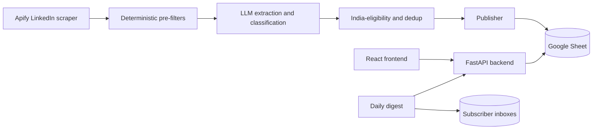

# Rise

[](https://github.com/djain18/internship-automation-pipeline/actions/workflows/ci.yml)

Rise scrapes LinkedIn hiring posts every night, uses an LLM to filter out scams
and ineligible roles, and publishes clean, India-eligible internships to a website
students can browse and apply from.

It is two systems that meet at a single Google Sheet — a **Python data pipeline**
(scrape → LLM extract/score → publish) and a **full-stack website** (FastAPI + React)
that reads the published data.

| | |
|---|---|
| Live site | https://rise-web-kappa.vercel.app |
| Live API | https://rise-api-production-a6c4.up.railway.app/api/listings |
| Filter quality | 100% precision / 100% recall on a labeled eval set |
| Tests | 67 unit tests, lint, and an eval gate — run in CI on every push |

---

## Architecture



The Google Sheet is the only coupling between the pipeline and the website. The
pipeline writes to it over Google OAuth; the API reads it through the public CSV
export. The LLM step tries OpenRouter, then Gemini, OpenAI, and Groq, and falls
back to a regex analyzer if every provider is unavailable.

---

## Engineering highlights

- **Resilient LLM cascade.** Extraction and classification try four providers in
  order and fall back to pure regex, so an API outage never hard-fails the run.
  See [`execution/llm_post_analyzer.py`](execution/llm_post_analyzer.py).
- **Concurrent scrape and analyze.** Ten LinkedIn queries scrape in parallel, then
  every post runs through the LLM on a thread pool, with partial results saved on
  timeout or out-of-memory instead of being lost.
- **Two-stage, testable filtering.** Cheap deterministic checks (scam, personal
  story, staleness) run before the LLM to save tokens; India-eligibility and dedup
  run after. The rules live in a pure, unit-tested module,
  [`execution/filters.py`](execution/filters.py).
- **Idempotent publishing.** Multi-key dedup (post URL plus normalized
  `company:role`) makes nightly re-runs safe; rows older than 15 days are pruned.
- **Measured stats, not fabricated ones.** The pipeline records scanned, rejected,
  and added counts to a `Meta` worksheet that `/api/stats` reads.
- **Serverless and scheduled.** Deployed on Modal with a nightly scrape cron and an
  8 AM IST digest cron.

---

## Repository layout

```
run_pipeline.py             Orchestrator: export keys -> scrape -> publish
modal_app.py                Modal serverless deploy and cron schedules
execution/
  scrape_linkedin_posts.py  Apify scrape and regex/LLM extraction
  llm_post_analyzer.py      LLM provider cascade and classification
  filters.py                Pure, tested scam/India/story/hiring predicates
  publish_to_sheets.py      Idempotent Google Sheets writer and Meta metrics
  send_daily_digest.py      Personalized daily email via Resend
  eval/                     Labeled dataset and precision/recall harness
  archive/                  Historical one-off scripts (not in the active path)
api/                        FastAPI backend (Railway), reads the Sheet
rise-web/                   React + Tailwind frontend (Vercel)
tests/                      pytest suite for the pure functions
```

---

## Quickstart

**Pipeline**

```bash
pip install -r requirements.txt
python run_pipeline.py
```

Requires `APIFY_API_TOKEN`, one LLM key, `GOOGLE_SHEET_ID`, and Google OAuth
(`credentials.json` / `token.json`) in `.env`.

**API**

```bash
cd api && pip install -r requirements.txt
uvicorn main:app --reload --port 8000
```

Routes: `GET /api/listings`, `GET /api/stats`, `POST /api/subscribe`, `GET /health`.

**Frontend**

```bash
cd rise-web && npm install
npm run dev   # set VITE_API_BASE to the API URL
```

---

## Testing

```bash
pytest                                     # unit tests
ruff check api tests execution/filters.py  # lint
python execution/eval/eval_filters.py      # precision/recall on the labeled set
```

CI runs all three on every push. The eval harness scores the deterministic filters
against a hand-labeled dataset ([`execution/eval/labeled_posts.json`](execution/eval/labeled_posts.json))
covering real internships, pay-to-work scams, personal stories, foreign roles, and
noise, and exits non-zero below threshold so it doubles as a regression gate.

---

## Tech stack

**Pipeline:** Python, Apify, OpenRouter / Gemini / OpenAI / Groq, Google Sheets API, Modal
**API:** FastAPI, httpx, Resend
**Frontend:** React, Vite, Tailwind, Framer Motion
**Infrastructure:** Railway (API), Vercel (web), Modal (pipeline)
**CI:** GitHub Actions, pytest, ruff
