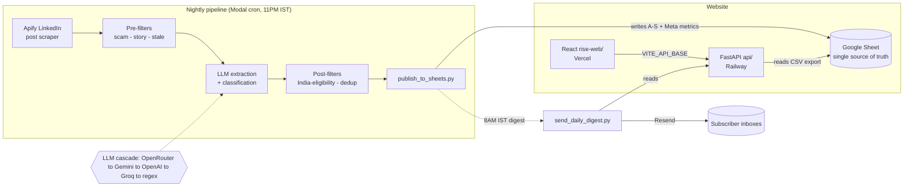

# Rise — Verified internships, published every night

Rise is an end-to-end system that **scrapes LinkedIn hiring posts every night, filters
out scams and ineligible roles with an LLM, and publishes clean, India-eligible
internships to a website students can browse and apply from.**

- 🌐 **Live site:** https://rise-web-kappa.vercel.app
- 🔌 **Live API:** https://rise-api-production-a6c4.up.railway.app/api/listings
- 🧪 **Filter quality:** 100% precision / 100% recall on a labeled eval set (see [Measuring quality](#measuring-quality))

It's two systems that meet at one Google Sheet: a **Python data pipeline** (scrape →
LLM extract/score → publish) and a **full-stack website** (FastAPI + React) that reads
the published data.

---

## Architecture



The Sheet is the **only** coupling between pipeline and website. The pipeline writes via
Google OAuth; the API reads via the public CSV export (sheet is "anyone with link can view").

---

## Engineering highlights

- **Resilient LLM cascade** — extraction/classification tries `OpenRouter → Gemini →
  OpenAI → Groq` and falls back to a pure-regex analyzer if every provider is down, so the
  pipeline never hard-fails on an API outage. See [`execution/llm_post_analyzer.py`](execution/llm_post_analyzer.py).
- **Concurrent scrape + analyze** — 10 LinkedIn queries scrape in parallel, then all posts
  run through the LLM on a thread pool, with graceful degradation on Modal OOM/timeout
  (partial results are saved rather than lost).
- **Two-stage, testable filtering** — cheap deterministic pre-filters (scam / personal-story
  / staleness) run before the LLM to save tokens; India-eligibility and dedup run after. The
  rules are extracted into a pure, unit-tested module: [`execution/filters.py`](execution/filters.py).
- **Idempotent publishing** — multi-key dedup (post URL + normalized `company:role`) makes
  nightly re-runs safe; stale rows (>15 days) are pruned automatically.
- **Real, measured stats** — the pipeline records `scanned / rejected / added` to a `Meta`
  worksheet, so the site's `/api/stats` shows *measured* numbers instead of fabricated ones.
- **Serverless & scheduled** — deployed on Modal with a nightly scrape cron and an 8AM IST
  digest cron; pay-per-second, no server to babysit.

---

## Repo layout

```
run_pipeline.py            # orchestrator: export keys -> scrape -> publish (with topup retries)
modal_app.py               # Modal serverless deploy + nightly/digest crons
execution/
  scrape_linkedin_posts.py # Apify scrape + regex/LLM extraction
  llm_post_analyzer.py     # LLM provider cascade + classification
  filters.py               # pure, tested scam/India/story/hiring predicates
  publish_to_sheets.py     # idempotent Google Sheets writer + Meta metrics
  send_daily_digest.py     # personalized daily email via Resend
  eval/                    # labeled dataset + precision/recall harness
  archive/                 # historical one-off scripts (not in the active path)
api/                       # FastAPI backend (Railway) — reads the Sheet
rise-web/                  # React + Tailwind + Framer Motion frontend (Vercel)
tests/                     # pytest suite for the pure pipeline/API functions
```

---

## Quickstart

### Pipeline
```bash
pip install -r requirements.txt
python run_pipeline.py          # local run: scrape -> score -> publish to the Sheet
```
Needs `APIFY_API_TOKEN`, one LLM key, `GOOGLE_SHEET_ID`, and Google OAuth
(`credentials.json` / `token.json`) in `.env`.

### API
```bash
cd api && pip install -r requirements.txt
uvicorn main:app --reload --port 8000   # needs GOOGLE_SHEET_ID
```
Routes: `GET /api/listings`, `GET /api/stats`, `POST /api/subscribe`, `GET /health`.

### Frontend
```bash
cd rise-web && npm install
npm run dev                     # set VITE_API_BASE to the API URL
```

---

## Testing & quality

```bash
pytest                                     # unit tests for pure functions
ruff check api tests execution/filters.py  # lint
python execution/eval/eval_filters.py      # precision/recall on the labeled set
```

CI runs all three on every push ([`.github/workflows/ci.yml`](.github/workflows/ci.yml)).

### Measuring quality

`execution/eval/eval_filters.py` runs the deterministic filters against a hand-labeled
dataset ([`labeled_posts.json`](execution/eval/labeled_posts.json)) covering real
internships, pay-to-work scams, personal stories, foreign roles, and noise — and reports
precision, recall, F1, and a per-reason rejection breakdown. It exits non-zero below the
threshold, so it doubles as a regression gate. Grow the dataset to make the metric stronger.

---

## Tech stack

**Pipeline:** Python, Apify, OpenRouter/Gemini/OpenAI/Groq, Google Sheets API, Modal (serverless cron)
**API:** FastAPI, httpx, Resend · **Frontend:** React, Vite, Tailwind, Framer Motion
**Infra:** Railway (API), Vercel (web), Modal (pipeline) · **CI:** GitHub Actions, pytest, ruff
