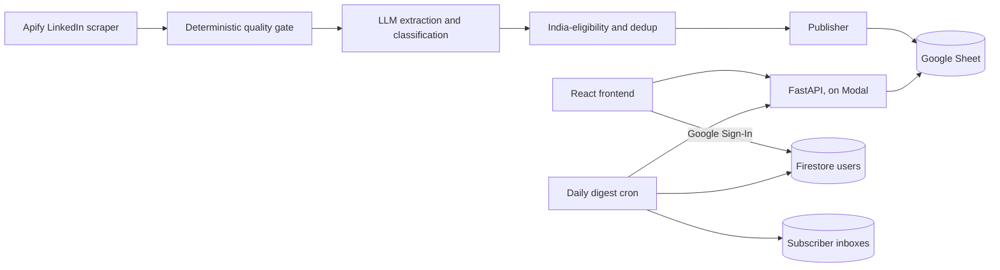

# Rise

[](https://github.com/djain18/internship-automation-pipeline/actions/workflows/ci.yml)

Rise scrapes LinkedIn hiring posts every night, runs them through a deterministic
anti-spam gate plus an LLM classifier, and publishes only genuine, India-eligible
internships to a website students can browse, filter, and get a daily matching
email for.

It's two systems that meet at a Google Sheet, and a Firestore collection — a
**Python data pipeline** (scrape → quality gate → LLM extract/score → publish)
and a **full-stack website** (FastAPI + React) that reads the published data and
handles Google Sign-In + personalized digest preferences.

| | |
|---|---|
| Live site | https://rise-web-kappa.vercel.app |
| Live API | https://dakshinjain187--internship-pipeline-api-web.modal.run |
| Filter quality | 100% precision / 100% recall on a labeled eval set |
| Tests | 75 unit tests, lint, and an eval gate — run in CI on every push |

---

## Architecture


```mermaid
flowchart LR
    A[Apify LinkedIn scraper] --> B[Deterministic quality gate]
    B --> C[LLM extraction and classification]
    C --> D[India-eligibility and dedup]
    D --> E[Publisher]
    E --> SHEET[(Google Sheet)]
    API[FastAPI, on Modal] --> SHEET
    WEB[React frontend] --> API
    WEB -- Google Sign-In --> AUTH[(Firestore users)]
    DIGEST[Daily digest cron] --> AUTH
    DIGEST --> API
    DIGEST --> MAIL[(Subscriber inboxes)]
```

The Google Sheet is the primary coupling between the pipeline and the website;
Firestore is a second, narrower one for sign-in preferences. The pipeline writes
to the Sheet over Google OAuth; the API reads it through the public CSV export.
The LLM step tries OpenRouter, then Gemini, OpenAI, and Groq, and falls back to
a regex analyzer if every provider is unavailable. Both the API and the pipeline
crons run on Modal (serverless), not a traditional host — the API used to run on
Railway, but that trial expired and it was rehosted.

---

## Engineering highlights

- **Quality-first anti-spam gate.** [`execution/quality_filter.py`](execution/quality_filter.py)
  is the single source of truth for scam patterns, aggregator/reposter detection,
  apply-method (rejects WhatsApp/"DM me"-only posts), unpaid-tech roles, and the
  Bengaluru-onsite-or-India-remote location rule — shared by both the scrape
  pre-filter and the LLM analysis phase, so a post can't slip through one and not
  the other. There's no hard publish quota: `run_pipeline.py`'s `TARGET_NEW` is a
  soft target, and a topup pass stops early once it stops finding genuinely new
  posts, rather than padding with lower-quality ones to hit a number.
- **Resilient LLM cascade.** Extraction and classification try four providers in
  order and fall back to pure regex, so an API outage never hard-fails the run.
  See [`execution/llm_post_analyzer.py`](execution/llm_post_analyzer.py).
- **Concurrent scrape and analyze.** Ten-plus LinkedIn queries scrape in parallel
  via Apify's `harvestapi/linkedin-post-search` actor, then every post runs
  through the LLM on a thread pool, with partial results saved on timeout instead
  of being lost.
- **Idempotent publishing.** Multi-key dedup (post URL plus normalized
  `company:role`) makes nightly re-runs safe; stale rows are pruned automatically.
- **Measured stats, not fabricated ones.** The pipeline records scanned, rejected,
  and added counts to a `Meta` worksheet that `/api/stats` reads.
- **Serverless and scheduled, with real alerting.** Deployed on Modal: a nightly
  scrape cron, an 8 AM IST digest cron, and a 30-minute API uptime check that
  actually raises on failure so a real outage pages instead of going unnoticed
  behind the frontend's seed-data fallback.
- **Google Sign-In, not a bare email form.** Students sign in with Google;
  digest preferences (fields, city, grad year) write straight to Firestore from
  the client, gated by schema-validating security rules bound to the signed-in
  user's own auth token. The daily digest cron reads that same collection via
  `firebase-admin` and matches roles to preferences server-side.

---

## Repository layout

```
run_pipeline.py               Orchestrator: export keys -> scrape -> publish
modal_app.py                  Modal serverless deploy: pipeline crons + API + uptime check
execution/
  scrape_linkedin_posts.py    Apify scrape (harvestapi actor) and regex/LLM extraction
  llm_post_analyzer.py        LLM provider cascade and classification
  quality_filter.py           Shared anti-spam/aggregator/location quality gate
  filters.py                  Older pure predicate set, still exercised by the eval harness
  publish_to_sheets.py        Idempotent Google Sheets writer and Meta metrics
  send_daily_digest.py        Firestore-subscriber matching + email via Resend
  founders_*.py               Separate personal job-feed pipeline (own Sheet) — unrelated to Rise
  eval/                       Labeled dataset and precision/recall harness
  archive/                    Historical one-off scripts (not in the active path)
api/                          FastAPI backend (Modal), reads the Sheet
rise-web/                     React + Tailwind frontend (Vercel), Firebase Auth + Firestore
firestore.rules               Security rules for the users/{uid} preferences collection
tests/                        pytest suite for the pure functions and API transforms
```

---

## Quickstart

**Pipeline**

```bash
pip install -r requirements.txt
python run_pipeline.py
```

Requires `APIFY_API_TOKEN`, one LLM key, `GOOGLE_SHEET_ID`, and Google OAuth
(`credentials.json` / `token.json`) in `.env`.

**API**

```bash
cd api && pip install -r requirements.txt
uvicorn main:app --reload --port 8000
```

Routes: `GET /api/listings`, `GET /api/stats`, `GET /health`. In production this
is served by the `api_web` function in `modal_app.py`, not this local command.

**Frontend**

```bash
cd rise-web && npm install
npm run dev   # set VITE_API_BASE and VITE_FIREBASE_* in rise-web/.env
```

**Deploy** (pipeline crons + API + uptime check, all on Modal)

```bash
MODAL_PROFILE=dakshinjain187 modal deploy modal_app.py
```

---

## Testing

```bash
pytest                                     # unit tests
ruff check api tests execution/filters.py execution/eval  # lint
python execution/eval/eval_filters.py      # precision/recall on the labeled set
```

CI runs all three on every push. The eval harness scores the deterministic
filters against a hand-labeled dataset
([`execution/eval/labeled_posts.json`](execution/eval/labeled_posts.json))
covering real internships, pay-to-work scams, personal stories, foreign roles,
and noise, and exits non-zero below threshold so it doubles as a regression gate.

---

## Tech stack

**Pipeline:** Python, Apify, OpenRouter / Gemini / OpenAI / Groq, Google Sheets API, Modal
**API:** FastAPI, httpx
**Auth & digest:** Firebase Authentication, Firestore, firebase-admin, Resend
**Frontend:** React, Vite, Tailwind, Framer Motion, Firebase JS SDK
**Infrastructure:** Modal (API + pipeline crons), Vercel (web)
**CI:** GitHub Actions, pytest, ruff
